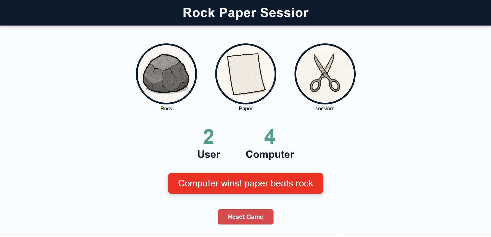

# 🎮 Rock Paper Scissors Game  

A simple and fun **Rock Paper Scissors** game built using **HTML, CSS, and JavaScript**.  
The user can choose Rock, Paper, or Scissors, and the computer randomly picks its choice. The winner is decided based on classic rules.  

---

## 🚀 Features  
- 🖱️ Click-based gameplay (Rock, Paper, or Scissors)  
- 🤖 Computer makes a random choice each round  
- 🏆 Live **scoreboard** for User and Computer  
- ⚡ Smooth animations & modern UI  
- 🔄 Reset button to restart the game anytime  

---

## 🕹️ Rules  
- Rock 🪨 beats Scissors ✂️  
- Paper 📄 beats Rock 🪨  
- Scissors ✂️ beats Paper 📄  
- Same choice → It's a **draw** 😅  

---

## 📸 Screenshots  

### 🎮 Game UI  



---

## 🛠️ Technologies Used  
- **HTML5** → Structure of the game  
- **CSS3** → Styling & animations  
- **JavaScript (ES6)** → Game logic and interactivity  

---

## 📂 Project Structure  

```
rock-paper-scissors/
│── index.html     # Main HTML file  
│── style.css      # Game styles  
│── app.js         # Game logic  
│── images/        # Rock, Paper, Scissors images  
│── README.md      # Project documentation  
```

---

## ▶️ How to Play  
1. Clone this repo:  
   ```bash
   git clone https://sumitt123.github.io/rock-paper-scissors/
   ```
2. Open **index.html** in your browser.  
3. Click **Rock, Paper, or Scissors** to play.  
4. See who wins 🎉  

---

## 🌐 Live Demo  
👉 [Play Here](https://sumitt123.github.io/rock-paper-scissors/)  

---

## 📜 License  
This project is **open-source** and free to use under the [MIT License](LICENSE).  
